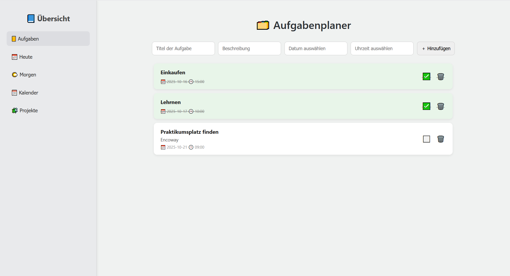
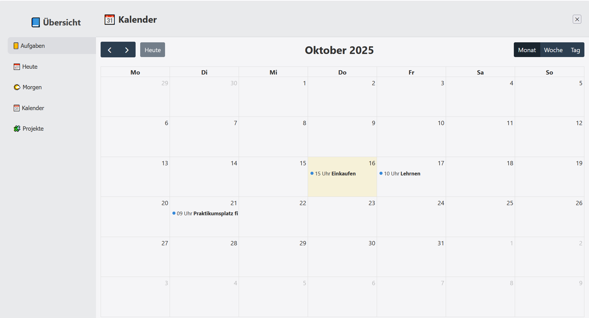
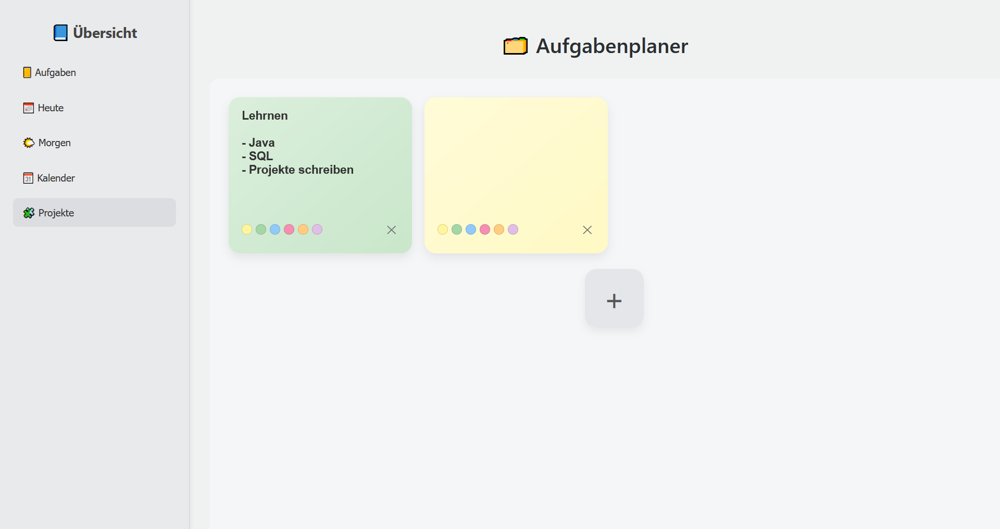

# 🗂️ Aufgabenplaner — To-Do + Kalender + Sticky Notes

**🌐 Live-Demo:** [https://aufgaben-backend.onrender.com](https://aufgaben-backend.onrender.com)  
_(Hinweis: Beim ersten Aufruf kann es 30–60 Sekunden dauern, bis der Server im Free-Tier aufwacht.)_

---

## ✨ Features
✅ Aufgaben erstellen, abhaken und löschen  
📅 Kalenderansicht mit Terminen (FullCalendar)  
📝 Sticky Notes / Kanban mit Farbe & Inline-Edit  
🗄️ REST API mit Spring Boot + H2-Datenbank  
🐳 Docker-Container, bereitgestellt über Render

---

## ⚙️ Tech Stack

| Bereich | Technologie |
|----------|--------------|
| **Backend** | Java 17 / Spring Boot 3 / JPA / H2 |
| **Frontend** | HTML / CSS / Vanilla JavaScript / FullCalendar / Flatpickr |
| **Deployment** | Docker + Render |
| **Build Tool** | Maven |

---

## 🔗 REST API Endpunkte

| Methode | Endpoint | Beschreibung |
|----------|-----------|--------------|
| `GET` | `/api/aufgaben` | Alle Aufgaben abrufen |
| `POST` | `/api/aufgaben` | Neue Aufgabe erstellen |
| `PUT` | `/api/aufgaben/{id}` | Aufgabe aktualisieren (z. B. erledigt = true) |
| `DELETE` | `/api/aufgaben/{id}` | Aufgabe löschen |
| `GET` | `/api/kanban/cards` | Alle Kanban-Karten abrufen |
| `POST` | `/api/kanban/cards` | Neue Karte hinzufügen |
| `PUT` | `/api/kanban/cards/{id}` | Karte bearbeiten |
| `DELETE` | `/api/kanban/cards/{id}` | Karte löschen |

---

## 🖼️ Screenshots

  
  
  

